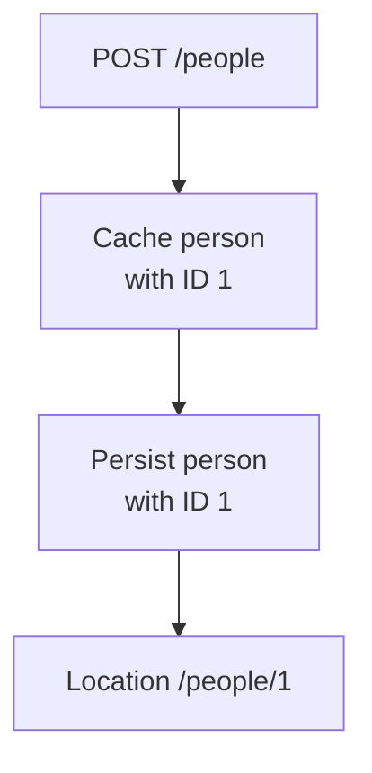
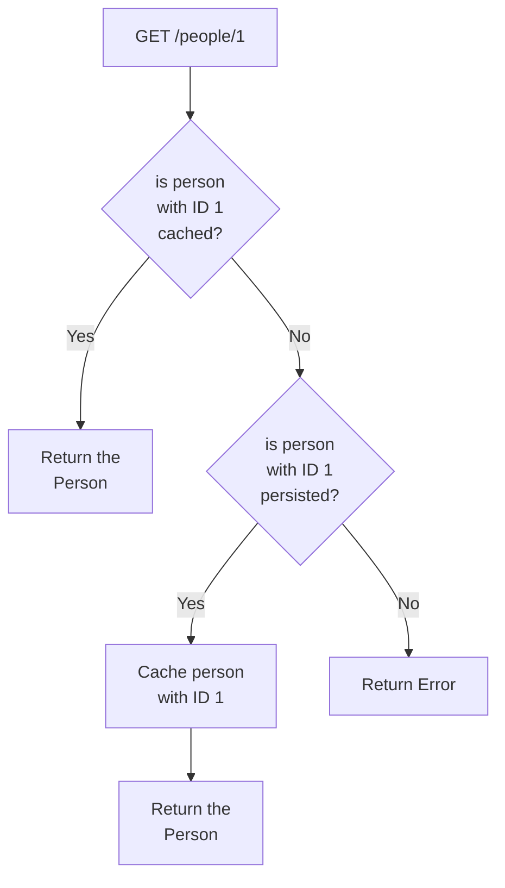

# POC: Redis Cache Write Through Strategy

It demonstrates how to implement caching based on write through strategy using Redis.

We want to implement a Web Service that allows us to create a person and find it by the random ID generated to the
person after persisting it on a Postgres relational database. The goal is to cache the data before sending it to the
relational database. That can help us to reduce the number of cache miss we have by guaranteeing the new data persisted
is on cache.

To avoid writing abstractions and boilerplate code, we are going to depend on Spring MVC for the Web layer, Spring Data
JPA for persistence on relational database and Spring Data Redis for caching. The source code should be evaluated using
automated tests with database containers provisioned by TestContainers and tests managed by JUnit.

Other approaches to cache are [Cache Aside](https://github.com/lucasvalenteds/poc-redis-cache-aside)
and [Write Back](https://github.com/lucasvalenteds/poc-redis-cache-write-back).

## How to run

| Description     | Command             |
|:----------------|:--------------------|
| Run tests       | `./gradlew test`    |
| Run application | `./gradlew bootRun` |

## Preview

Write Through Strategy write execution flow:



Write Through Strategy read execution flow:



Logging output after creating a person:

```text
2022-07-09T10:41:29.484-03:00  INFO 6063 --- [o-auto-1-exec-1] o.a.c.c.C.[Tomcat].[localhost].[/]       : Initializing Spring DispatcherServlet 'dispatcherServlet'
2022-07-09T10:41:29.484-03:00  INFO 6063 --- [o-auto-1-exec-1] o.s.web.servlet.DispatcherServlet        : Initializing Servlet 'dispatcherServlet'
2022-07-09T10:41:29.485-03:00  INFO 6063 --- [o-auto-1-exec-1] o.s.web.servlet.DispatcherServlet        : Completed initialization in 1 ms
2022-07-09T10:41:29.682-03:00  INFO 6063 --- [o-auto-1-exec-1] com.example.person.PersonServiceDefault  : Person cached (key=edaf2eaf-b3d7-4b43-af47-c0e83f461448, value=Person(id=edaf2eaf-b3d7-4b43-af47-c0e83f461448, name=John Smith, age=45))
2022-07-09T10:41:29.702-03:00  INFO 6063 --- [o-auto-1-exec-1] com.example.person.PersonServiceDefault  : Person saved (person=Person(id=edaf2eaf-b3d7-4b43-af47-c0e83f461448, name=John Smith, age=45))
```

Logging output after finding the person by ID multiple times:

```text
2022-07-09T10:41:29.749-03:00  INFO 6063 --- [o-auto-1-exec-2] com.example.person.PersonServiceDefault  : Person retrieved from cache (personId=edaf2eaf-b3d7-4b43-af47-c0e83f461448)
2022-07-09T10:41:29.770-03:00  INFO 6063 --- [o-auto-1-exec-3] com.example.person.PersonServiceDefault  : Person retrieved from cache (personId=edaf2eaf-b3d7-4b43-af47-c0e83f461448)
2022-07-09T10:41:29.778-03:00  INFO 6063 --- [o-auto-1-exec-4] com.example.person.PersonServiceDefault  : Person retrieved from cache (personId=edaf2eaf-b3d7-4b43-af47-c0e83f461448)
2022-07-09T10:41:29.786-03:00  INFO 6063 --- [o-auto-1-exec-5] com.example.person.PersonServiceDefault  : Person retrieved from cache (personId=edaf2eaf-b3d7-4b43-af47-c0e83f461448)
2022-07-09T10:41:29.795-03:00  INFO 6063 --- [o-auto-1-exec-6] com.example.person.PersonServiceDefault  : Person retrieved from cache (personId=edaf2eaf-b3d7-4b43-af47-c0e83f461448)
```
